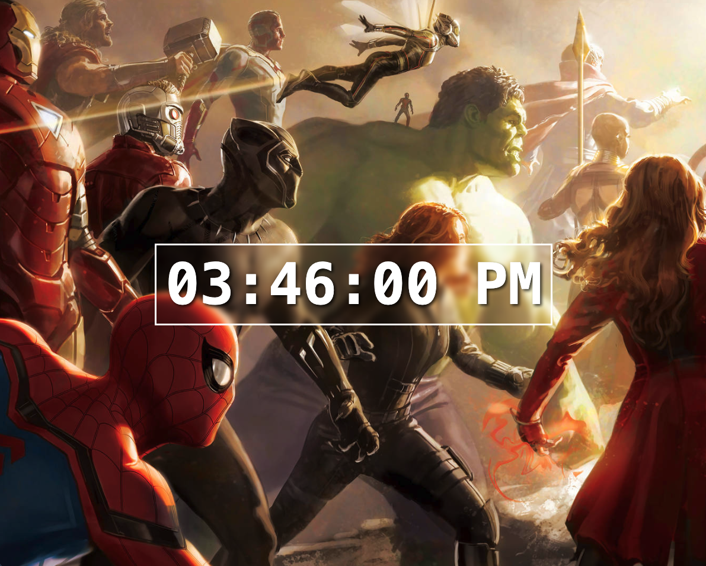

# React Digital Clock

A beautiful digital clock built with **React** using hooks. Displays real-time 12-hour format with seconds and AM/PM, featuring a frosted glass effect overlay on a custom background image.

## Features
- ⏰ Real-time 12-hour format with AM/PM (`hh:mm:ss AP`)
- 🔄 Updates every second using `setInterval`
- 🎨 Frosted glass backdrop filter effect
- 🖼️ Custom background image with full-screen coverage
- 🧹 Proper cleanup on component unmount
- ⚛️ Built with React hooks (`useState`, `useEffect`)
- 🎭 Text shadow for enhanced readability
- 📱 Centered layout with responsive design

## Requirements
- Node.js (v14 or higher)
- npm or yarn package manager
- React (v18 or higher recommended)

## Project structure
```
.
├── src/
│   ├── App.jsx
│   ├── DigitalClock.jsx
│   ├── index.css
│   ├── assets/
│   │   └── background.png
│   └── main.jsx (or index.jsx)
├── package.json
└── README.md
```

## Installation

1. **Clone or download the project**

2. **Add your background image**
   - Place your background image in `src/assets/background.png`
   - Or update the path in `index.css`

3. **Install dependencies**
```bash
npm install
# or
yarn install
```

4. **Run the development server**
```bash
npm run dev
# or
yarn dev
```

5. **Open in browser**
Navigate to `http://localhost:5173` (or the port shown in your terminal)

## Screenshots


* The clock interface features:
  - **Full-screen background image** with fixed attachment
  - **Frosted glass container** with 5px backdrop blur
  - **White border** (3px solid) around clock container
  - **Large time display** (6rem, white, bold, monospace)
  - **Text shadow** (3px offset, 5px blur) for depth
  - **Centered layout** (vertically and horizontally)
  - **12-hour format** with leading zeros (e.g., "03:45:12 PM")

## Usage

The clock automatically starts when the app loads and updates every second. No user interaction required!

## Component Architecture

### App.jsx
Main application component that renders the DigitalClock:
```javascript
import DigitalClock from "./DigitalClock.jsx"

function App() {
    return <DigitalClock />;
}
```

### DigitalClock.jsx
Core component containing all clock functionality:

**State Management:**
```javascript
const [time, setTime] = useState(new Date());
```
- `time`: Holds current date/time object
- Updated every second via `setInterval`

**Key Hooks and Functions:**

**1. useEffect Hook**
Manages the interval lifecycle:
```javascript
useEffect(() => {
    const intervalId = setInterval(() => {
        setTime(new Date());
    }, 1000);

    return () => {
        clearInterval(intervalId);
    }
}, []);
```
- Runs only on component mount (empty dependency array `[]`)
- Sets up interval to update time every 1000ms (1 second)
- Returns cleanup function to clear interval on unmount
- Prevents memory leaks by clearing interval when component is removed

**2. formatTime()**
Converts Date object to readable 12-hour format:
```javascript
function formatTime() {
    let hours = time.getHours();
    const minutes = time.getMinutes();
    const seconds = time.getSeconds();
    const meridiem = hours >= 12 ? "PM" : "AM";
    hours = hours % 12 || 12; // Convert to 12-hour format
    return `${padZero(hours)}:${padZero(minutes)}:${padZero(seconds)} ${meridiem}`;
}
```
- Extracts hours, minutes, seconds from Date object
- Determines AM/PM based on hours (>= 12 is PM)
- Converts 24-hour to 12-hour format using modulo operator
- Handles midnight (0) and noon (12) correctly
- Returns formatted string with leading zeros

**3. padZero(number)**
Adds leading zero to single-digit numbers:
```javascript
function padZero(number) {
    return (number < 10 ? "0" : "") + number;
}
```
- Checks if number is less than 10
- Prepends "0" if true, otherwise empty string
- Examples: `3 → "03"`, `15 → "15"`

## Time Conversion Logic

### 24-hour to 12-hour conversion:
```javascript
hours = hours % 12 || 12;
```
- `13 % 12 = 1` → 1 PM
- `14 % 12 = 2` → 2 PM
- `12 % 12 = 0 || 12` → 12 PM (noon)
- `0 % 12 = 0 || 12` → 12 AM (midnight)

### AM/PM determination:
```javascript
const meridiem = hours >= 12 ? "PM" : "AM";
```
- Hours 0-11 → AM
- Hours 12-23 → PM

## Styling

### Background
- **Image**: `url(assets/background.png)`
- **Position**: Centered
- **Size**: Cover (fills entire viewport)
- **Repeat**: No repeat
- **Attachment**: Fixed (stays in place when scrolling)

### Clock Container
- **Backdrop filter**: 5px blur (frosted glass effect)
- **Border**: 3px solid white
- **Padding**: 10px vertical, 15px horizontal

### Clock Display
- **Font**: Monospace (for consistent digit width)
- **Size**: 6rem
- **Weight**: Bold
- **Color**: White
- **Text shadow**: `3px 3px 5px hsl(0, 0%, 0%, 0.75)` (black with 75% opacity)
- **Alignment**: Centered

### Layout
- **Flexbox**: Centers clock vertically and horizontally
- **Min-height**: 100vh (full viewport height)
- **Margin**: 0 (removes default body margin)

## Customize

### Background Image
Replace the image path in `index.css`:
```css
body {
    background-image: url(assets/your-image.jpg);
}
```

### Clock Colors
Change text color:
```css
.clock {
    color: #00ff00; /* Change to any color */
}
```

### Border Style
Modify container border:
```css
.clock-container {
    border: 5px solid rgba(255, 255, 255, 0.5); /* Thicker, semi-transparent */
    border-radius: 15px; /* Add rounded corners */
}
```

### Font Size
Adjust clock display size:
```css
.clock {
    font-size: 8rem; /* Larger */
    font-size: 4rem; /* Smaller */
}
```

### Blur Effect
Increase or decrease backdrop blur:
```css
.clock-container {
    backdrop-filter: blur(10px); /* More blur */
    backdrop-filter: blur(2px); /* Less blur */
}
```

### Time Format
Switch to 24-hour format in `DigitalClock.jsx`:
```javascript
function formatTime() {
    const hours = time.getHours();
    const minutes = time.getMinutes();
    const seconds = time.getSeconds();
    return `${padZero(hours)}:${padZero(minutes)}:${padZero(seconds)}`;
}
```

## React Concepts Used

- **Hooks**:
  - `useState`: Manages time state
  - `useEffect`: Handles side effects (interval)
- **Component Lifecycle**:
  - Mount: Sets up interval
  - Update: Re-renders every second
  - Unmount: Cleans up interval
- **Cleanup Function**: Prevents memory leaks
- **Date Object**: JavaScript built-in for time
- **Template Literals**: String formatting with backticks
- **Ternary Operators**: Conditional expressions
- **JSX**: React's XML-like syntax

## Performance Considerations

- **Interval cleared on unmount**: Prevents memory leaks
- **Empty dependency array**: Effect runs only once
- **Minimal re-renders**: Only updates when time changes
- **Efficient date handling**: Uses native Date object

## Browser Compatibility

- **Backdrop filter**: Modern browsers (Chrome 76+, Safari 9+, Firefox 103+)
  - Falls back gracefully without blur on older browsers
- **Flexbox**: All modern browsers
- **Date object**: Universal JavaScript support

## Notes

- Time updates precisely every second
- No external dependencies required (uses vanilla React)
- Background image must be in `src/assets/` folder for Vite to bundle it
- Cleanup function is crucial to prevent interval from running after unmount
- Uses `let` for hours since it's reassigned in 12-hour conversion
- `const` for minutes/seconds since they don't change
- Monospace font ensures digits don't shift when changing (e.g., 1 vs 8)

## Troubleshooting

### Background image not showing
- Check file path: `src/assets/background.png`
- Verify image exists and has correct name
- Try absolute path or import the image in component

### Clock not updating
- Check browser console for errors
- Verify `useEffect` is running (add console.log)
- Ensure interval isn't being cleared prematurely

### Blur effect not working
- Check browser compatibility for `backdrop-filter`
- Try `-webkit-backdrop-filter` for Safari support

## Build for Production
```bash
npm run build
# or
yarn build
```

This creates an optimized production build in the `dist` folder.

## Possible Enhancements

- Add date display (day, month, year)
- Include timezone selection
- Add alarm functionality
- Implement stopwatch/timer modes
- Add customizable color themes
- Include seconds toggle (hide/show)
- Add multiple timezone clocks
- Implement 12/24-hour format toggle
- Add smooth animation transitions
- Include digital/analog switch
- Add sound on the hour
- Implement dark/light mode

---

Happy timekeeping! ⏰